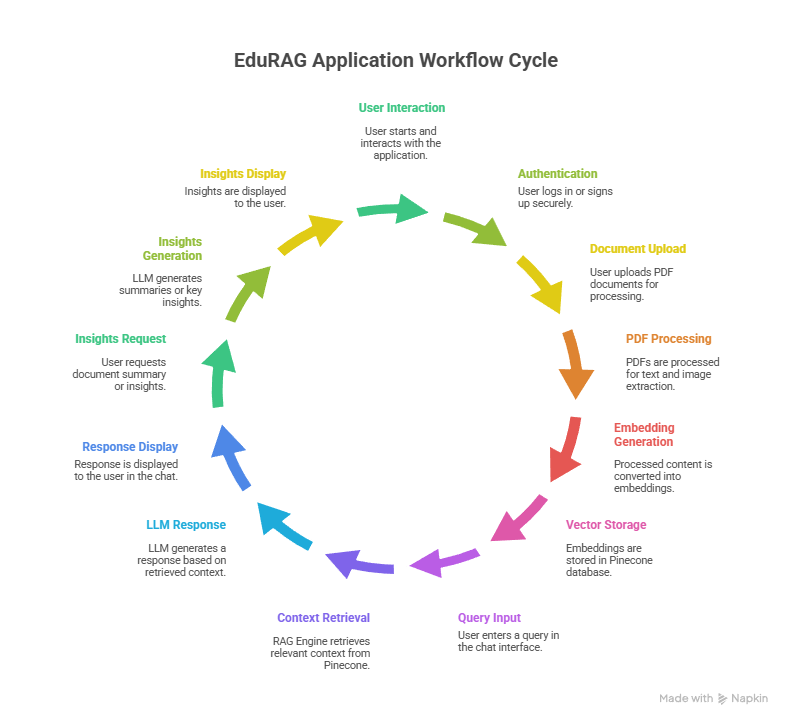
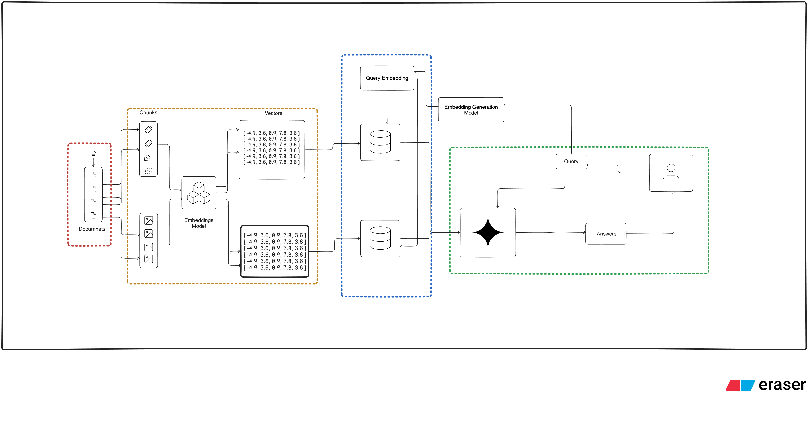

📘 AskManual — Product Manual Assistant

AskManual is an intelligent, document-aware assistant designed to navigate complex product manuals and user guides and deliver instant, precise answers using compressed contexts.

It enables users to interact naturally with manuals—asking questions, extracting summaries, and identifying critical information—while ensuring minimal token usage, fast retrieval, and zero hallucination.

🔐 All responses are generated strictly from user-uploaded manuals, with no external knowledge leakage.

🧠 Problem Statement  
Product Manual Assistant  

Build a system to navigate complex product manuals and user guides using compressed contexts, enabling instant answers with minimal token usage.

Modern product manuals are often:
- Long and unstructured  
- Difficult to search  
- Filled with tables, images, and scanned pages  

AskManual addresses this by transforming manuals into structured, searchable knowledge, enabling accurate question answering and insight extraction in real time.

🎯 Key Capabilities  
📄 Intelligent parsing of digital and scanned PDFs using OCR  
✂️ Context-preserving semantic chunking without breaking sections or chapters  
🔍 Vector-based semantic search using Pinecone  
📊 Accurate table extraction and understanding  
🖼️ OCR-powered text extraction from images  
🧠 Strict document-bound answering (no hallucinations)

🌟 Unique Features  
✨ What makes AskManual stand out:

🌍 Multilingual Support  
Understand and query manuals written in multiple languages using multilingual embeddings.

⚡ One-Click Important Information Extraction  
Instantly extract key operational or technical points from a manual.

🧾 One-Click Summary Generation  
Generate concise, structured summaries of long manuals.

📸 Advanced OCR for Images & Tables  
Extract text from scanned images and accurately interpret complex tables.

🧩 Solution Overview  

AskManual implements an end-to-end PDF-to-Knowledge RAG pipeline with authentication and document isolation.

High-level Flow  
- User logs into the system  
- User uploads product manuals (PDF)  
- Manuals are:
  - OCR-processed (if needed)
  - Chunked into meaningful sections
  - Indexed into Pinecone
- User selects a manual as active context  
- User can:
  - 💬 Ask questions via Chat
  - 📊 Extract summaries or key insights via Insights  

All outputs are strictly grounded in the selected manual.

🏗️ System Architecture  
### 🔹 Application Flow

### 🔹 RAG Workflow

- 📘 **Full Project Report (PDF):**
  [View Report](./assets/Product_Manual_Assistant.pdf)

- 📊 **Project Video Explanation (PPT):**
  [View Presentation](./assets/Ask.mp4)

Google Drive Link - https://drive.google.com/drive/folders/1tOilEWdhiJGysP-yrvNp8kMeS40c78R0?usp=sharing

⚙️ Tech Stack  
Layer | Technology  
Backend | FastAPI (modular architecture)  
Database | MongoDB Atlas (User Management)  
Vector DB | Pinecone (Semantic Search)  
LLM | Groq API (LLaMA-3)  
Embeddings | Google Generative AI  
Auth | HTTP Basic Auth + bcrypt  
Frontend | React  

🧩 Core Modules  
Module | Responsibility  
auth/ | User authentication & password hashing  
chat/ | Context-aware RAG chat logic  
vectordb/ | PDF loading, OCR, chunking & indexing  
database/ | MongoDB connection and persistence  
main.py | FastAPI entry point and routing  

📡 API Endpoints  
Method | Endpoint | Description  
POST | /signup | Register user  
GET | /login | Authenticate user  
POST | /upload_docs | Upload product manuals  

🚀 Getting Started  

1️⃣ Clone the Repository  
git clone <repository-url>  
cd <project-folder>  

2️⃣ Environment Variables  
Create a `.env` file:

MONGO_URI=your_mongo_uri  
DB_NAME=your_db_name  
PINECONE_API_KEY=your_pinecone_api_key  
PINECONE_INDEX_NAME=your_index  
GOOGLE_API_KEY=your_google_api_key  
# Recommended (Organizer Suggested)
SCALEDOWN_API_KEY=your_scaledown_api_key

# Optional (Alternative LLM Backend)
# If using Groq instead of ScaleDown,
# replace chat_query.py with groq_chat_query.txt implementation.
GROQ_API_KEY=your_groq_api_key

3️⃣ Virtual Environment  
uv venv  
.venv/Scripts/activate  

4️⃣ Install Dependencies  
uv pip install -r requirements.txt  

5️⃣ Run Backend  
uvicorn main:app --reload  

6️⃣ Run Frontend  
cd react_frontend  
npm run dev  

🔐 Security Design  
🔒 Secure authentication  
🔑 bcrypt password hashing  
📂 User-isolated manuals  
🧠 Context-scoped responses  
🚫 No cross-document leakage  

📊 Performance Evaluation  
🔍 AskManual Evaluation Results  

PDF processing time per page (s): 0.0041  
PDF processing time per document (s): 4.03  
OCR accuracy (%): 96.43  
Chunking accuracy (%): 66.67  
Search latency (s): 1.2358  
Precision / Recall / MRR: 0.20 / 1.00 / 1.00  
Table extraction accuracy (%): 95.00  
Pinecone vector count: 455  

These results demonstrate efficient document ingestion, high OCR reliability, and fast semantic retrieval, making AskManual suitable for real-world manual navigation.

👨‍💻 Developer  
Ismail Sk — AI / ML Engineer  

🔗 GitHub: https://github.com/Ismail007-Sk  
🧠 RAG pipeline design & optimization  
⚙️ Backend, frontend, and overall system architecture
📊 Evaluation & performance benchmarking  

📜 License  
This project was developed as part of **ScaleDown Challenge 2** under the **Gen AI for GenZ** initiative.

⭐ If you find AskManual helpful, consider starring the repository!
